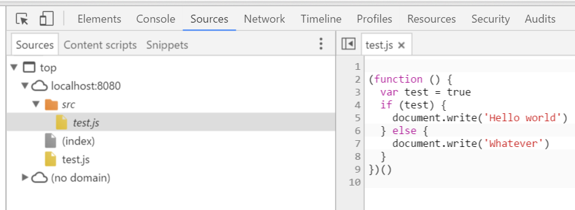
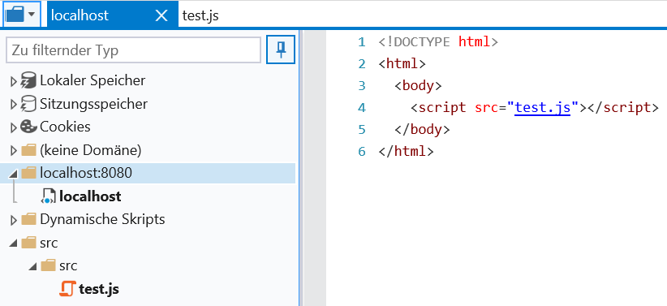

Example for reproducing the MS Edge sourcemaps bug

## How to build
 - Install NodeJS and NPM
 - Run `npm install`
 - Run `npm run build`
 - Deploy `build`-directory, for example with [http-server](https://www.npmjs.com/package/http-server)
 
## Output
`test.js`:
```javascript
!function(){var e=!0;e?document.write("Hello world"):document.write("Whatever")}();
//# sourceMappingURL=test.js.map
```

`test.js.map`:
```json
{
  "version": 3,
  "sources": [
    "src/test.js"
  ],
  "names": [
    "test",
    "document",
    "write"
  ],
  "mappings": "CACA,WACE,GAAIA,IAAO,CACPA,GACFC,SAASC,MAAM,eAEfD,SAASC,MAAM",
  "file": "src/test.js",
  "sourcesContent": [
    "\n(function () {\n  var test = true\n  if (test) {\n    document.write('Hello world')\n  } else {\n    document.write('Whatever')\n  }\n})()\n"
  ],
  "sourceRoot": "file:///c:/Users/felix/git/opensource/edge-sourcemaps-bug"
}
```

As you can see, the `sourceRoot` is correctly set to the root folder and the source file is correctly referenced with `src/test.js`.

## Expected Dev Tools Output (Chrome Debugger)


## Actual Dev Tools Output (Edge)


 - the root folder is not shown at all
 - the `src` folder is duplicated (the same behaviour would occur for any referenced folder, like `node_modules`)
